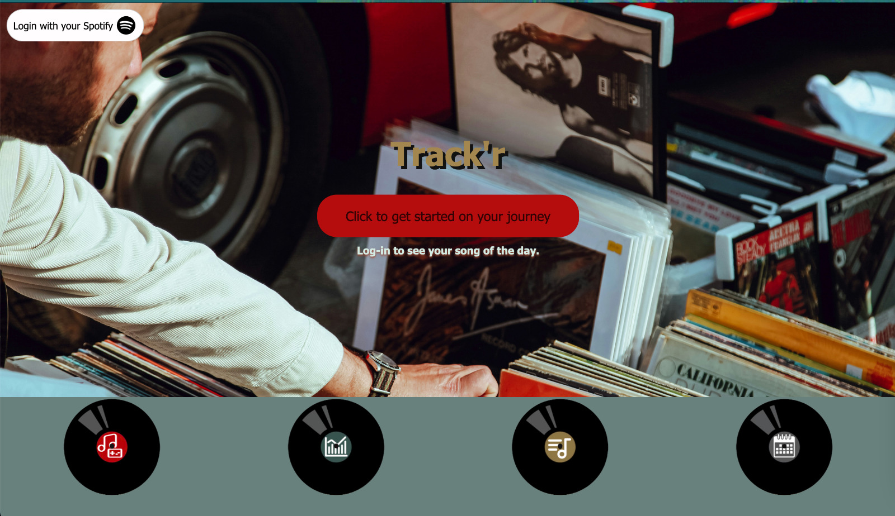
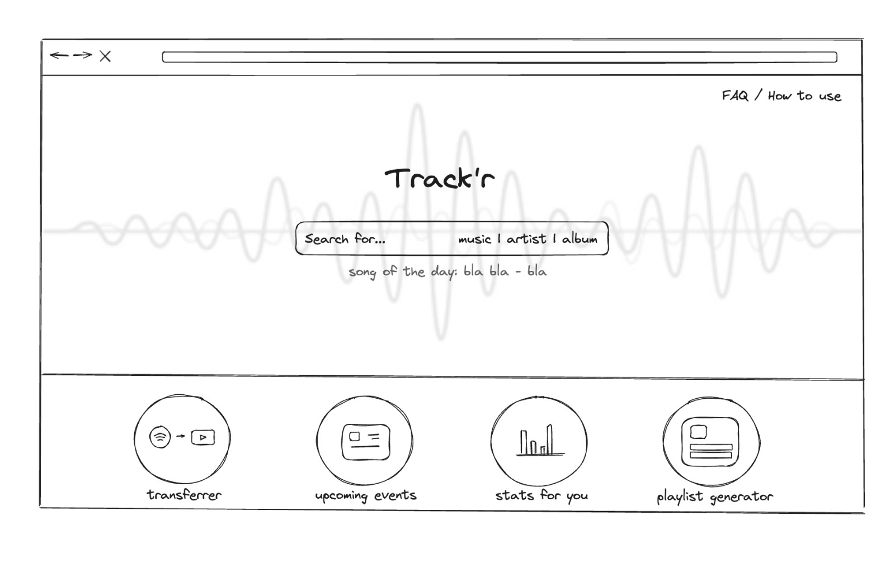

# Project Title

## Brief description of the project
Track’r is a Spotify tools website -  able to show stats, get recommended songs, and more, built by a group of friends. The project is driven by Flask, and uses the Spotify API for fetching user information or information about elements (tracks, artists, etc.) Using CSS, HTML and JavaScript, our Frontend provides a responsive, animated and visually appealing UI. There are interactive elements, clickable tracks, authorization, and even a game. Our goal was to create a user-friendly, good-looking website that could provide the user with many tools regarding their Spotify. Some of the website tools were tested with beta-testers, and they received huge amounts of appreciation.

Observing the success of this small project, I have decided to build on the idea and the implementation that we had with my friends, by asking their permission for their work. I turned this into an individual project by working on this small foundation, started by fixing some of the problems that we had, and no time to fix. I added many other features that I thought would make the website better. Now, by uploading this project to my gitbub account I am aiming to record my progress on further devolopments of this project of mine.

## Frontend mockup

## Installation details
Create environment & install requirements

How to create environment

  On Windows
    1. Clone the repository
    2. Open cmd and go to repository directory 
    3. Type `python -m venv venv` (to create)
    4. Type `venv\Scripts\activate` (to activate)
    5. Type `pip install -r requirements.txt` (to install dependencies)
    6. Type `pip freeze` (to check if packages were installed correctly) *(OPTIONAL)*

  On MacOS
    1. Clone the repository
    2. Open terminal and go to repository directory 
    3. Type `python3 -m venv venv` (to create)
    4. Type `source venv/bin/activate` (to activate)
    5. Type `pip install -r requirements.txt` (to install dependencies)
    6. Type `pip list` (to check if packages were installed correctly) *(OPTIONAL)*
    

Run app.py file (and go to 127.0.0.1:5000)
